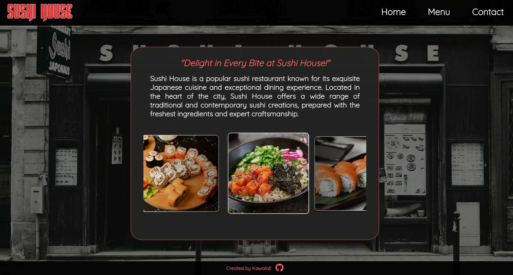

The Sushi Restaurant Page is a web application developed using JavaScript, HTML, and CSS. The project incorporates ESLint for code quality and utilizes Webpack for efficient bundling of files. The responsive design ensures a seamless experience across different devices.
<h2><a href="https://kawalae.github.io/Restaurant-page/">Click here to view!</a></h2>

<h2><strong>Technologies used</strong></h2>

</img>
</img>
</img>
</img>
</img>

 
<h2><strong>Project description</strong></h2>
 

</img>

</img>

</img>

<h2><strong>Acknowledgements</strong></h2>

- imgage of Poke Bowl - <a href="https://www.freepik.com/free-photo/hawaiian-salmon-fish-poke-bowl-with-rice-radish-cucumber-tomato-sesame-seeds-seaweeds-buddha-bowl-diet-food_7677628.htm#page=2&query=japanese%20food&position=21&from_view=search&track=ais#position=21&page=2&query=japanese%20food%22%3EImage">Image by timolina</a>  
- image of Philadelphia rolls - <a href="https://www.freepik.com/free-photo/philadelphia-rolls-with-salmon-cream-cheese_5588179.htm#page=2&query=sushi%20salmon&position=26&from_view=search&track=ais">Image by azerbaijan_stockers</a>  
- image of Sashimi - <a href="https://www.freepik.com/free-photo/close-up-salmon-sashimi-served-with-red-tobiko_7184541.htm#query=sushi%20salmon&position=4&from_view=search&track=ais">Image by KamranAydinov</a>  
- image of Ramen - <a href="https://www.freepik.com/free-photo/composition-noodles-bowl_11741072.htm#query=ramen%20with%20egg&position=4&from_view=search&track=ais">Freepik</a>  
- image of Sushi - <a href="https://www.freepik.com/free-photo/side-view-roll-with-soy-sauce-chopstick-hand_7727088.htm#page=3&query=sushi&position=6&from_view=search&track=sph">Image by 8photo</a>  
- image of Sushi - <a href="https://www.freepik.com/free-vector/location-app-concept_10131452.htm#page=2&query=vertical%20city%20map%20street%20name&position=10&from_view=search&track=ais">Freepik</a>  
- logo - <a href="https://flamingtext.com/logo/Design-Japan-Logo-Maker">Logo generator</a>
- favicon - <a target="_blank" href="https://icons8.com/icon/ezIe7ZFqCuXk/sushi-roll">Sushi Roll</a> icon by <a target="_blank" href="https://icons8.com">Icons8</a>
- background picture - Photo by <a href="https://unsplash.com/@christianallard?utm_source=unsplash&utm_medium=referral&utm_content=creditCopyText">Christian Allard</a> on <a href="https://unsplash.com/photos/etIkw39orF8?utm_source=unsplash&utm_medium=referral&utm_content=creditCopyText">Unsplash</a>
  
